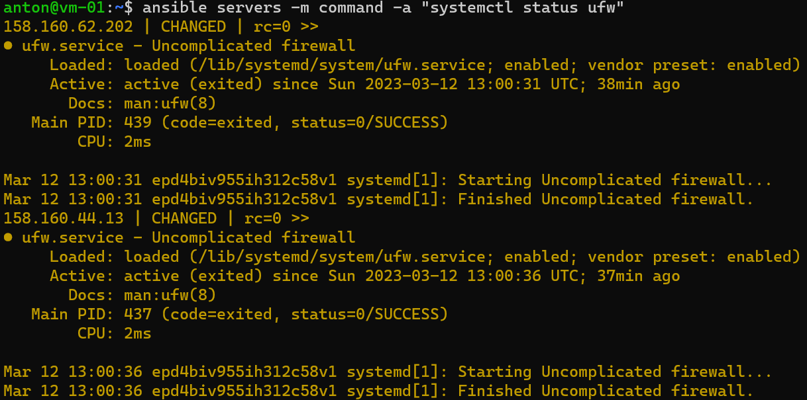

# Домашнее задание к занятию "7.1. Ansible. Часть 1" Белов Антон
## Задание 1
Какие преимущества даёт подход IAC?

Скорость развертывания, масштабируемость и стандартизация за счет автоматизации при развертывании инфраструктуры.

Упрощение документации и повышение безопасности путем приведения инфраструктуры к единым стандартам.

Скорость восстановления инфраструктуры до работоспособного состояния в случае сбоя или катастрофы.

## Задание 2
>Выполните действия и приложите скриншоты действий.

>Создайте файл inventory. Предлагается использовать файл, размещённый в папке с проектом, а не файл inventory по умолчанию.

>Проверьте доступность хостов с помощью модуля ping.

## Задание 3
>Какая разница между параметрами forks и serial?

Параметр `forks` отвечает за количество параллельных процессов, которые Ansible будет использовать при выполнении задач на удаленных хостах. Когда Ansible выполняет задачу на нескольких хостах одновременно, эта опция позволяет задать количество хостов, которые могут быть обработаны одновременно. Например, если значение "forks" равно 5, то Ansible будет выполнять задачи на 5 хостах одновременно.

Параметр `serial` задает количество хостов, на которых Ansible будет выполнять задачи последовательно. Если значение "serial" равно 1, то Ansible будет выполнять задачи на каждом хосте последовательно, передвигаясь от одного хоста к другому, пока все задачи не будут выполнены на всех хостах. Если значение "serial" больше 1, то Ansible будет выполнять задачи на заданном количестве хостов одновременно, передвигаясь далее к следующей группе хостов.

## Задание 4
>Выполните действия и приложите скриншоты запуска команд.

`ansible servers -b -m apt -a "name=nmon state=present"`

`ansible servers -m command -a "systemctl status ufw"`

`ansible servers -m shell -a 'echo "I like Linux" > /tmp/netology.txt'`

