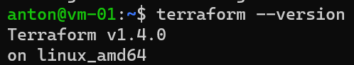
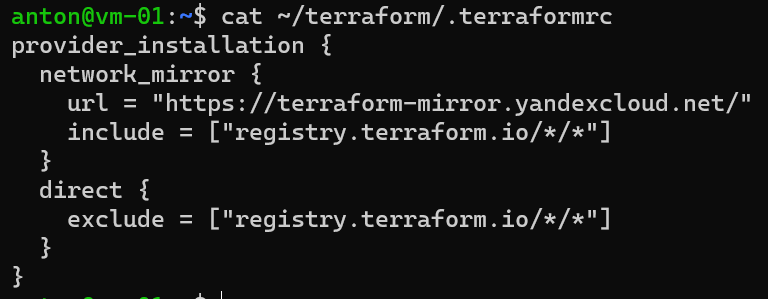
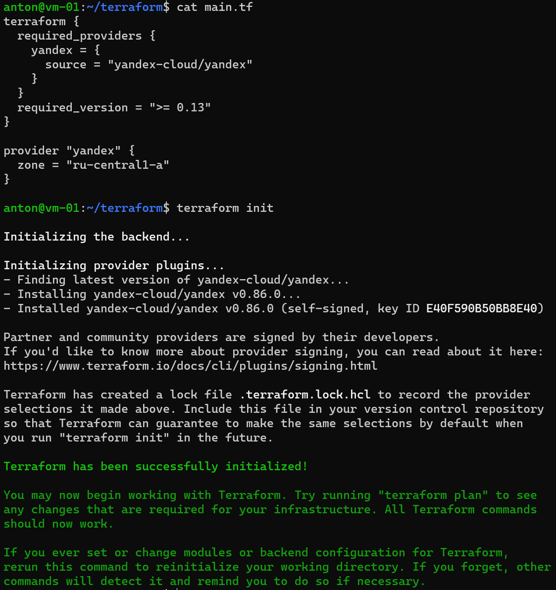

# Домашнее задание к занятию "7.2. Terraform" Белов Антон
## Задание 1
> Опишите виды подхода к IaC:

Функциональный подход к IaC описывает инфраструктуру в виде функций, использует декларативный код (описываем конечное состояние). Он обеспечивает гибкость и переносимость между платформами.

Процедурный подход к IaC описывает инфраструктуру в виде последовательности шагов. Его преимущества - относительная простота и понятность, но есть недостатки в поддержке и переносимости между платформами.

Интеллектуальный подход к IaC основан на анализе и использовании данных для принятия решений в режиме реального времени. Он использует машинное обучение, искусственный интеллект и другие технологии для определения оптимальной конфигурации инфраструктуры. Он позволяет автоматизировать принятие решений и улучшить производительность.

## Задание 2
>Как вы считаете, в чём преимущество применения Terraform?

Terraform является инструментом, который позволяет создавать, изменять и удалять инфраструктуру с помощью кода, что значительно экономит время и минимизирует ошибки в настройке по сравнению с ручным методом. Один из главных преимуществ Terraform перед другими инструментами IaC заключается в том, что он поддерживает все основные провайдеры облачных сервисов и имеет обширное сообщество пользователей.

## Задание 3
>Какие минусы можно выделить при использовании IaC?

Высокие расходы на обучение персонала и внедрение подхода IaC.

Высокая цена ошибки, которая может привести к недоступности приложений или потере данных.

Возможная зависимость от конкретного инструмента или облачного провайдера.

Сложность конфигурации инфраструктуры, особенно для сложных сценариев использования.

## Задание 4
>Установите Terraform на компьютерную систему (виртуальную или хостовую), используя лекцию или инструкцию.

`sudo apt-get install -y gnupg software-properties-common curl`

`curl -fsSL https://apt.releases.hashicorp.com/gpg | sudo apt-key add -`

`sudo apt-add-repository "deb [arch=amd64] https://apt.releases.hashicorp.com $(lsb_release -cs) main"`

`sudo apt update && sudo apt install -y terraform`

**Настраиваем TF для использования зеркал ЯО**

**Конфигурируем провайдера и инициализируем TF**

